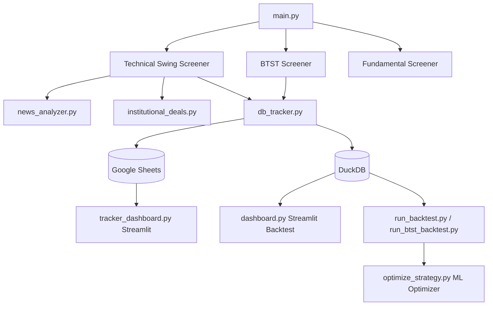

# NSE Swing & BTST Trade Screener + Live Google Sheets Tracker & Dashboards

A production-ready, rules-based daily trading workflow for the National Stock Exchange of India (NSE). It screens the symbol universe (Nifty 100/200/500) using multi-factor technical setups, secondary news sentiment filters, corporate event alerts, and institutional deal catalogs. It outputs candidate alerts to Telegram/WhatsApp and maintains a real-time position tracker synced directly with Google Sheets.

---

## 🌟 Core Features & Architecture



### 1. Technical Swing Screener ([screener.py](file:///Users/a200146527/PycharmProjects/Swing_Stocks_Notifier/screener.py))
Scores stocks based on **19 technical indicators** (0 to 19+ max score). Candidates scoring above `MIN_SCORE` are flagged with dynamic stop-losses and targets.
* **Indicator Details & Scoring System:**
  1. **Uptrend Filter:** Price above rising SMA50 (SMA50 current > 5 days ago).
  2. **Momentum Zone (RSI14):** RSI(14) in the healthy 45–65 zone.
  3. **Oversold Bounce (RSI14):** RSI(14) crossed up through 30 in the last 3 sessions.
  4. **MACD Bullish Crossover:** MACD line crosses above Signal line within the last 3 sessions.
  5. **Volume Spike:** Today's volume > 1.5x of the 20-day average volume.
  6. **Near 20-day High:** Close price is within 1% of the 20-day high (breakout proximity).
  7. **Strong Trend (ADX):** ADX > 25, indicating a strong trend.
  8. **SMA Bullish Crossover:** SMA50 crossed above SMA100 within the last 5 sessions.
  9. **Open-Low Same (OLS):** Today's Open equals Today's Low (within 0.2% tolerance), signaling immediate buyer conviction.
  10. **Strong RSI Momentum:** RSI(14) in the high momentum 65–80 zone.
  11. **SMA100 Support Pullback:** Close price bounces off a rising SMA100.
  12. **Volume Contraction (VCP):** Average volume of the last 3 sessions is < 95% of the 20-day average volume (low selling pressure).
  13. **Weekly Trend Alignment:** Weekly EMA20 equivalent trend is up and Weekly RSI > 50.
  14. **Relative Strength (RS):** Stock is outperforming the benchmark index (Nifty 50) and RS line is rising.
  15. **Stochastic Pullback:** %K crosses above %D under 25 (oversold crossover).
  16. **Bollinger Band Pullback:** Bounces off the lower Bollinger Band.
  17. **Inside Bar Breakout:** Today's Close breaks above yesterday's High, where yesterday was an inside bar.
  18. **NR7 Breakout:** Breaks out from a Narrow Range 7 pattern.
  19. **EMA 9/21 Pullback:** Low touches the EMA21 support during an uptrend on low volume.
  20. **Hammer at key support:** A bullish hammer candle form at SMA50, SMA100, or SMA200.

* **Setup Classifications:**
  * `rsi2_pullback` (Larry Connors RSI(2) setup): Closes above SMA200, Nifty index is above SMA200, and RSI(2) < 5. *(Highest priority setup with >70% historical win-rate)*.
  * `pullback_sma50` (Golden Pullback): Pulled back near a rising SMA50.
  * `momentum_breakout`: High-volume breakout (VCP breakout + volume spike + near 20-day high).
  * `macd_crossover`: Recent MACD bullish crossing.
  * `momentum`: General trend-following momentum.

* **Dynamic ATR-Based Risk Management:**
  * **RSI(2) Pullback:** Stop-loss = `2.0 * ATR` below Close. Target = `5-day SMA` (mean reversion target).
  * **Golden Pullback SMA50:** Stop-loss = `1.5 * ATR` below rising SMA50. Target = entry risk multiplied by `RISK_REWARD_RATIO`.
  * **Momentum Breakout:** Stop-loss = `2.0 * ATR` below Close. Target = risk multiplied by `RISK_REWARD_RATIO`.
  * **MACD Crossover:** Stop-loss = `2.5 * ATR` below Close. Target = risk multiplied by `RISK_REWARD_RATIO`.

### 2. BTST (Buy Today, Sell Tomorrow) Screener ([btst_screener.py](file:///Users/a200146527/PycharmProjects/Swing_Stocks_Notifier/btst_screener.py))
Scans for high-velocity candidates intended for quick next-day exits.
* **Criteria:**
  * Current price is above 20 and 50 SMAs.
  * Current price closes near the high of the day (within 0.7% of the session high).
  * Volume spike (>= 2.0x of the 20-day average volume).
  * Strong daily return (Close > Open and return >= 1.5%).
  * RSI(14) in the momentum zone (55 to 78).
  * Broader market filter (Nifty 50 above SMA50) and 20-day relative strength outperformance.
* **Fixed targets:** Exit targets are set to +1.5% (target) and -1.5% (stop-loss).

### 3. Fundamental Screener ([fundamental_screener.py](file:///Users/a200146527/PycharmProjects/Swing_Stocks_Notifier/fundamental_screener.py))
* Checks value/profile metrics like **Price-to-Book ratio** (flags when Close <= Book Value or Low <= Book Value) to find undervalued candidates.

### 4. News Sentiment & Event Risk Filter ([news_analyzer.py](file:///Users/a200146527/PycharmProjects/Swing_Stocks_Notifier/news_analyzer.py))
* **Sentiment Scoring:** Scours recent headlines using `yfinance`. Adjusts the technical score (+1 for Bullish sentiment, -1 for Bearish sentiment).
* **Event Risk Mitigation:** Queries upcoming corporate events (earnings calendars) from NSE. If earnings occur within 5 days, it warns of volatility risk.

### 5. Institutional Deals Catalyst ([institutional_deals.py](file:///Users/a200146527/PycharmProjects/Swing_Stocks_Notifier/institutional_deals.py))
* Downloads daily bulk and block deals CSV from NSE archives. Aggregates buys/sells to detect institutional interest. Adds +1 to score for bulk buy deals, or subtracts 1 for bulk sell deals.

### 6. Live Tracker Database ([db_tracker.py](file:///Users/a200146527/PycharmProjects/Swing_Stocks_Notifier/db_tracker.py))
Maintains synchronization with a Google Sheet spreadsheet containing three worksheets:
* `daily_results`: History of candidates flagged daily.
* `open_positions`: Active positions tracker. Automatically updates current prices, tracks returns, and handles exits.
* `position_progress`: Stores sequential closing prices for 15 days following entry.

### 7. Optimization & Permutations Suite ([optimize_strategy.py](file:///Users/a200146527/PycharmProjects/Swing_Stocks_Notifier/optimize_strategy.py))
* Reads historical backtest signals from `backtest_results/` and uses scikit-learn decision trees or random forests to extract optimal setups (win rate and parameters).

---

## 🚀 Setup & Installation

The project uses [uv](https://github.com/astral-sh/uv), an extremely fast Python package manager.

### 1. Install `uv`
```bash
# macOS / Linux
curl -LsSf https://astral-sh/uv/install.sh | sh

# Windows (PowerShell)
powershell -c "irm https://astral-sh/uv/install.ps1 | iex"
```

### 2. Install Project Dependencies
Clone the repository and run `uv sync` to set up the virtual environment (`.venv`) and install all lockfile dependencies:
```bash
git clone https://github.com/surajpattewar/Swing_Stocks_Notifier.git
cd Swing_Stocks_Notifier
uv sync
```

### 3. Environment Configuration
Copy `.env.example` to `.env`:
```bash
cp .env.example .env
```
Fill out the variables inside `.env`:

| Variable | Description | Default |
| --- | --- | --- |
| `TELEGRAM_BOT_TOKEN` | Bot token from @BotFather | (Empty) |
| `TELEGRAM_CHAT_ID` | Your chat/channel ID | (Empty) |
| `SEND_TELEGRAM` | Send results to Telegram | `False` |
| `SEND_WHATSAPP` | Send results to Twilio WhatsApp | `False` |
| `MIN_SCORE` | Minimum score for technical signals | `3` |
| `TOP_N_ALERTS` | Maximum candidates to send in alerts | `7` |
| `GOOGLE_SHEET_NAME` | Name of Google Sheet tracker | `Swing Stocks Tracker` |
| `GOOGLE_SHEETS_CREDENTIALS_PATH` | Path to Google Service Account JSON | `google_credentials.json` |

> [!NOTE]
> To configure **Google Sheets integration**, save your service account credentials key file as `google_credentials.json` in the root directory, or load the raw JSON text into the `GOOGLE_SHEETS_CREDENTIALS_JSON` environment variable.

---

## 💻 Running the Screener

### Running the Live Daily Screener
Runs the technical, BTST, and fundamental screeners, performs news/deals analysis, updates the Google Sheet database, and alerts Telegram/WhatsApp:
```bash
uv run main.py
```

### Running the Offline Screener
Screens using price history stored locally inside the DuckDB database (does not fetch live Yahoo Finance data):
```bash
uv run run_offline_screener.py
```

---

## 🧪 Backtesting Suite

### 1. Ingest/Update Historical Local Data
Populate your local DuckDB database (`data/duckdb/screener_data.duckdb`) with the historical price bars:
```bash
uv run data_ingestion.py
```

### 2. Run Technical Swing Backtests
Simulates the performance of the technical screener rules using local DuckDB bars:
```bash
uv run run_backtest.py
```

### 3. Run BTST Backtests
Backtests the performance of the BTST momentum rules:
```bash
uv run run_btst_backtest.py
```

### 4. Run Online Backtest with Permutations
Runs backtests directly against `yfinance` history and calculates combinations of indicator subsets to find optimal rules:
```bash
uv run backtest_yfinance.py --max-stocks 50 --workers 6
```

---

## 📈 Streamlit Dashboards

### 1. Live Position Tracker Dashboard
Visualizes active swing trades, closed performance analytics (win rate, average return), and day-wise progress from Google Sheets:
```bash
uv run streamlit run tracker_dashboard.py
```

### 2. Backtest Analyzer Dashboard
Visualizes historical backtest results, returns by technical score, trade statistics, and metrics loaded from DuckDB:
```bash
uv run streamlit run dashboard.py
```

---

## 🧠 Strategy Rule Optimization

After running a backtest which saves signals inside the `backtest_results/` directory, trigger the scikit-learn optimizer to extract highest-win-rate decision paths:
```bash
uv run optimize_strategy.py --min-samples 15 --max-rules 5
```

---

## 🤖 Automating Deployment (GitHub Actions)

The repository includes a GitHub Action workflow file `.github/workflows/daily_screener.yml` that runs the screener automatically from Monday to Friday at 3:45 PM IST (10:15 AM UTC). 

1. Create a private GitHub repository.
2. Go to **Settings > Secrets and variables > Actions**.
3. Add your secrets: `TELEGRAM_BOT_TOKEN`, `TELEGRAM_CHAT_ID`, and (if using Twilio) `TWILIO_ACCOUNT_SID`, `TWILIO_AUTH_TOKEN`, etc.
4. Add `GOOGLE_SHEETS_CREDENTIALS_JSON` with the raw text content of your service account key.

---

## ⚠️ Disclaimer
Technical analysis setups are screening indicators only and can produce false signals. Markets involve substantial risk of loss. This tool is for educational purposes only and does not constitute financial or investment advice.
